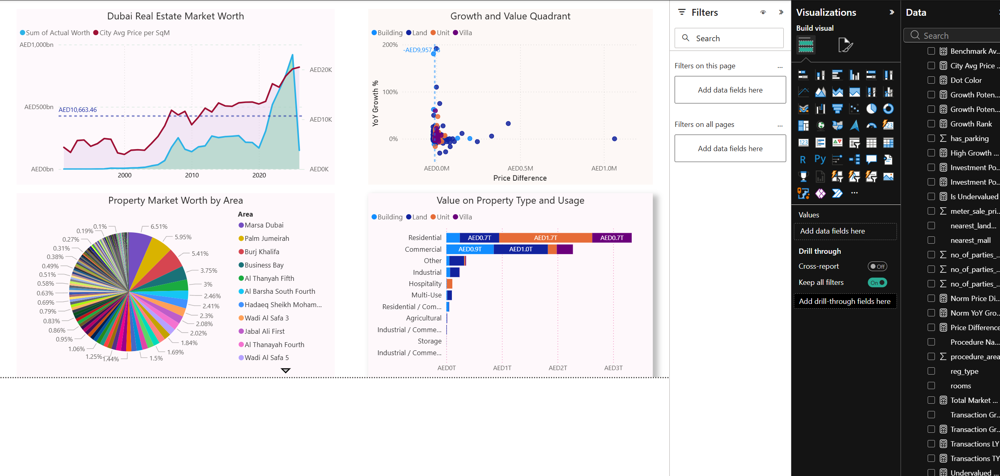
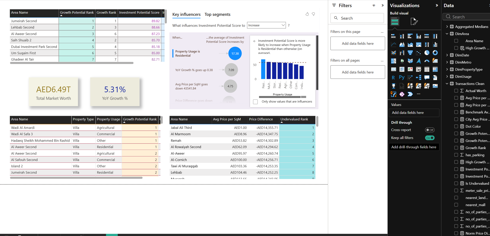
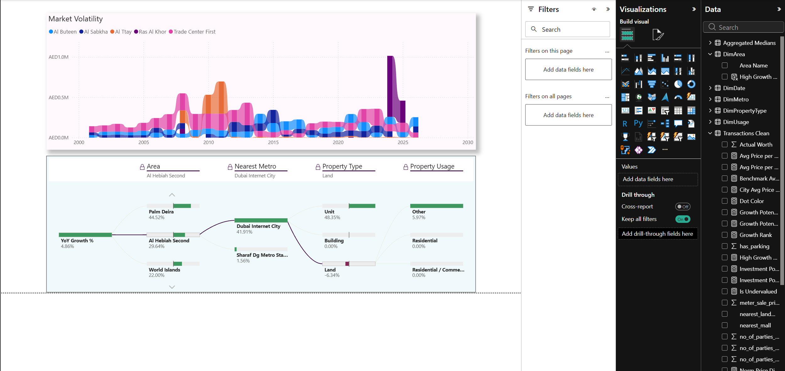
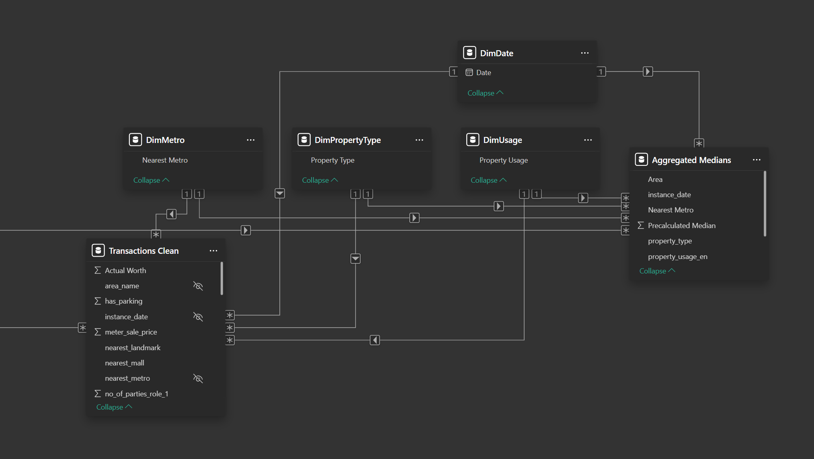

# Dubai Real Estate Strategic Investment Model


## Summary
A strategic, end-to-end data model analyzing over 500,000 historical real estate transactions in the Dubai market. This project moves beyond standard descriptive reporting to provide **prescriptive analytics**, identifying undervalued and high-growth neighborhoods for strategic investment and urban planning. 





## Data Provenance & Reproducibility
Due to GitHub file size constraints and data governance best practices, the raw 1GB transaction dataset is not hosted in this repository. 

* **Primary Source:** Dubai Land Department (DLD) via the [Dubai Pulse Open Data Portal](https://data.dubai/en/). (Formerly Dubai Pulse, now Data.Dubai)
* **Model Execution:** The provided `.pbix` file contains the fully compressed, aggregated data model and will run natively without requiring a local connection to the raw CSV.

---

## 1. The Business Strategy & Logic
To provide actionable intelligence, the model evaluates neighborhoods based on two distinct investment personas:

* **The Market Momentum Strategy (Investment Potential Score):** A 0-to-100 normalized index identifying short-to-medium-term market equilibrium plays. It mathematically isolates areas exhibiting high historical momentum (YoY Growth %) but remaining heavily undervalued compared to the city median (Negative Price Difference).
* **The Urban Planning Strategy (Growth Potential Rank):** A forward-looking metric incorporating spatial infrastructure data. It evaluates neighborhood undervaluation against proximity to critical transit nodes (e.g., nearest Dubai Metro stations) to predict gentrification and future growth corridors before they reflect in historical transaction data.

---

## 2. Data Engineering & Architecture Overhaul
Working with granular, row-level property transactions created significant computational overhead. Attempting to calculate dynamic median pricing across half a million rows utilizing iterative DAX functions (`MEDIANX`) exceeded the 1GB VertiPaq memory limit during visual rendering.

**The Solution: Dimensional Aggregation**
Instead of compromising statistical accuracy by reverting to simple averages, I engineered a highly optimized Star Schema featuring an **Aggregated Fact Table**.

* Compressed the primary dataset in Power Query by grouping row-level data by all relevant dashboard dimensions (`Area Name`, `Property Type`, `Usage`, `Nearest Metro`, and `Year`).
* Pre-calculated the `meter_sale_price` medians at the aggregate level.
* Reduced query evaluation time to milliseconds and RAM utilization to near-zero while preserving flawless, dynamic filtering for the end-user.



---

## 3. Advanced DAX & Analytical Implementation
The dashboard relies heavily on sophisticated DAX to ensure statistical baselines remain stable regardless of user interaction.

* **Context Transition Management:** Handled visual-level filter conflicts by utilizing `ALL('DimArea'[Area Name])` instead of `ALLSELECTED()`. This ensures that Normalization equations and Rank functions grade individual neighborhoods against the *global* city baseline rather than a localized, misleading curve when a user limits the table to a "Top 10" view.
* **Dynamic Measure Branching:** Built a dependency tree where complex metrics (YoY Growth, Price Difference, Normalization) branch from a single optimized base measure, ensuring hyper-efficient model calculation.

```dax
Investment Potential Rank = 
IF(
    ISBLANK([Investment Potential Score]),
    BLANK(),
    RANKX(
        ALL('DimArea'[Area Name]), 
        [Investment Potential Score], 
        , 
        DESC, 
        Dense
    )
)
```

---

## 4. Key Visualizations & Features
* **The Magic Quadrant Matrix:** A dynamically color-coded scatter plot featuring calculated median crosshairs to isolate "Hidden Gem" properties based on YoY Growth and Price Difference.
* **AI Root-Cause & Key Influencer Analysis:** Integrated Power BI's AI Decomposition Tree and Key Influencers visuals to conduct dynamic Exploratory Data Analysis (EDA). This instantly identifies whether property type, usage, or transit proximity is the highest contributing factor to price variance and investment potential.
* **Rank Volatility (Ribbon Chart):** Visualizes the historical disruption of the Dubai market, mapping exactly when emerging neighborhoods overtook legacy districts in value.
* **Market Worth Tracking:** High-level executive overviews tracking historical market capitalization against the city's average price per square meter.

---

## How to View the Project
* **[View the Dashboard Presentation (PDF)](Dubai%20Realty%20Official%20Report.pdf)** for a high-resolution look at the visuals and matrix layouts.
* [The raw `.pbix` file can be accessed using this Google Drive Link] (https://drive.google.com/file/d/1tnsNtN9VXi9vs0Ss0Dclo7C14LMB1KIX/view?usp=sharing)
